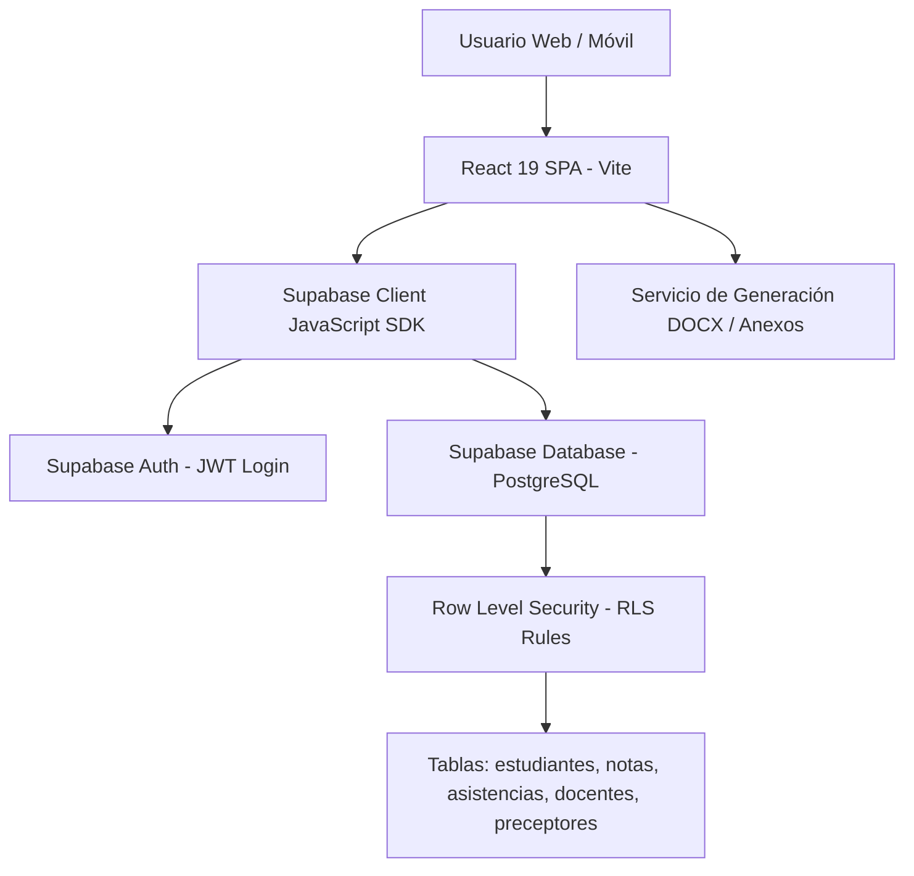

# Documento Técnico Maestro: Clonación de Sistema de Gestión Académica para CENS 454 (Esteban Echeverría)

> **Versión del Documento:** 1.0.0  
> **Institución Destino:** CENS N° 454 - Esteban Echeverría  
> **Plataforma Base:** EscolarApp / Sistema de Gestión CENS 456  
> **Fecha de Especificación:** Julio 2026  

---

## 1. Visión General del Proyecto

El **Sistema de Gestión CENS 454** es una plataforma web integral diseñada para la administración académica, control de asistencia, carga de calificaciones, seguimiento de trayectorias formativas y gestión institucional de la educación de adultos (CENS - Centro Educativo de Nivel Secundario N° 454 de Esteban Echeverría).

Este documento especifica la **arquitectura técnica**, el **modelo de despliegue**, la **seguridad por nivel de filas (RLS)** y las **instrucciones paso a paso** para clonar, adaptar e instanciar el sistema desde CENS 456 hacia CENS 454.

---

## 2. Pila Tecnológica (Tech Stack)

La aplicación sigue una arquitectura desacoplada moderna (*BaaS - Backend as a Service*):

| Capa | Tecnología / Herramienta | Descripción y Versión |
| :--- | :--- | :--- |
| **Frontend Framework** | React 19 + Vite 7 | Interfaz reactiva en SPA (*Single Page Application*) con React Router v7. |
| **Estilos & UI** | Tailwind CSS v4 + Vanilla CSS | Sistema visual customizado *"Estilo Horizonte Académico"*. |
| **Backend & BaaS** | Supabase (PostgreSQL 15+) | Base de datos relacional, Auth (JWT), Storage y Realtime. |
| **Seguridad de Datos** | PostgreSQL RLS (Row Level Security) | Políticas RLS por rol (`admin`, `preceptor`, `profesor`, `estudiante`). |
| **Íconos & UI Helpers** | Lucide React + SweetAlert2 + React Hot Toast | Iconografía moderna e interacciones modales avanzadas. |
| **Generación de Documentos** | docxtemplater + pizzip + docx | Generación dinámica de planillas oficiales (Anexo 4, Anexo 5, Resúmenes). |
| **Visualización de Datos** | Recharts v3 | Gráficos estadísticos de retención, desgranamiento e inasistencias. |
| **Hosting & CI/CD** | Vercel / Netlify | Despliegue automatizado continuous deployment conectado a GitHub. |

---

## 3. Arquitectura del Sistema y Roles de Usuario



### Matriz de Permisos por Rol (`userRole`)

| Módulo / Funcionalidad | Directivo (`admin`) | Preceptor (`preceptor`) | Docente (`profesor`) | Estudiante (`estudiante`) | Público |
| :--- | :---: | :---: | :---: | :---: | :---: |
| **Dashboard y Estadísticas General** | ✅ Lectura/Escritura | ❌ | ❌ | ❌ | ❌ |
| **Gestión de Cursos y Materias** | ✅ Lectura/Escritura | ❌ | ❌ | ❌ | ❌ |
| **Asistencia Diaria por Curso** | ✅ Lectura/Escritura | ✅ Lectura/Escritura | ❌ | ❌ | ❌ |
| **Alertas y Riesgo de Inasistencia** | ✅ Lectura/Escritura | ✅ Lectura/Escritura | ❌ | ❌ | ❌ |
| **Portal Docente y Carga de Notas** | ✅ Lectura/Escritura | ❌ | ✅ Cursos asignados | ❌ | ❌ |
| **Libro de Temas / DICYT** | ✅ Lectura/Escritura | ✅ Lectura/Escritura | ❌ | ❌ | ❌ |
| **Portal Estudiante (Boletín/Legajo)** | ✅ Lectura/Escritura | ❌ | ❌ | ✅ Su propio legajo | ❌ |
| **Preinscripciones Institucionales** | ✅ Administración | ✅ Procesamiento | ❌ | ❌ | ❌ |
| **Formulario Público Preinscripción** | ❌ | ❌ | ❌ | ❌ | ✅ Form público |
| **Generación de Anexos DOCX** | ✅ Generación | ❌ | ❌ | ❌ | ❌ |

---

## 4. Estructura de Directorios y Organización del Código

```
sistemadegestioncens454/
├── public/
│   ├── logo.png                     # Isologo oficial del CENS 454
│   ├── manifest.json                # PWA Web App Manifest
│   └── sw.js                        # Service Worker para caché offline
├── src/
│   ├── assets/                      # SVG e imágenes de apoyo
│   ├── components/                  # Componentes y Paneles
│   │   ├── Dashboard.jsx            # Panel de control administrativo
│      ├── PreceptorsPanel.jsx       # Gestión de asistencia y planillas
│      ├── AlertsPanel.jsx           # Semáforo de riesgo e inasistencias
│      ├── TeacherPortal.jsx         # Portal de profesores y vinculaciones
│      ├── GradesPanel.jsx           # Carga de notas quadrimestrales y finales
│      ├── StudentPortal.jsx         # Consulta de boletín y materias para alumnos
│      ├── LibroDicyt.jsx            # Libro de temas y partes diarios DICYT
│      ├── PreinscripcionPanel.jsx   # Gestión de solicitudes de ingreso
│      ├── PreinscripcionPublica.jsx # Formulario abierto a la comunidad
│      ├── SecretariaPanel.jsx       # Altas/Bajas, legajos y certificados
│      ├── StatsDashboard.jsx        # Gráficos y analítica institucional
│      ├── CourseManager.jsx         # ABM Cursos, Orientaciones y Divisiones
│      └── ScheduleManager.jsx       # Asignación de horarios y materias
│   ├── context/
│   │   └── FilterContext.jsx        # Estado global de ciclo lectivo y filtros
│   ├── lib/
│   │   ├── supabase.js              # Inicialización del cliente Supabase
│      ├── alerts.js                # Helpers para notificaciones SweetAlert2
│      └── generateAnexoDocx.js      # Exportador oficial DOCX
│   ├── App.jsx                      # Enrutamiento principal y Layout
│   ├── index.css                    # Tokens de diseño Tailwind v4 y variables CSS
│   └── main.jsx                     # Punto de entrada de React 19
├── templates/                       # Plantillas Word (.docx) para Anexos 4 y 5
├── sql/                             # Scripts de migración y funciones RPC Supabase
├── .env.example                     # Variables de entorno modelo
├── package.json                     # Dependencias y scripts
└── vite.config.js                   # Configuración del empaquetador Vite
```

---

## 5. Configuración de Entorno y Variables (.env)

Para inicializar el clon del CENS 454, crear un archivo `.env` en la raíz con las credenciales de la instancia de Supabase dedicada:

```env
# Configuración Supabase CENS 454 (Esteban Echeverría)
VITE_SUPABASE_URL=https://<TU-PROYECTO-CENS454>.supabase.co
VITE_SUPABASE_ANON_KEY=eyJhbGciOiJIUzI1NiIsInR5cCI6IkpXVCJ9...

# Información Institucional CENS 454
VITE_CENS_NUMBER=454
VITE_CENS_DISTRICT="Esteban Echeverría"
VITE_CENS_REGION="Región 5"
VITE_CENS_ADDRESS="Esteban Echeverría, Buenos Aires"
```

---

## 6. Procedimiento de Clonación e Instalación Paso a Paso

### Paso 1: Obtener el Repositorio Base
```bash
git clone https://github.com/cens456ezeiza-dot/sistemadegestioncens456.git sistemadegestioncens454
cd sistemadegestioncens454
```

### Paso 2: Limpieza de Referencias Históricas
Modificar `package.json` para actualizar la identidad del proyecto:
```json
{
  "name": "sistema-gestion-cens454",
  "version": "1.0.0",
  "private": true
}
```

### Paso 3: Instalación de Dependencias
```bash
npm install
```

### Paso 4: Creación e Inicialización del Proyecto en Supabase
1. Ingresar a [Supabase Dashboard](https://supabase.com) y crear un proyecto titulado `cens454-estebanecheverria`.
2. En el Editor SQL de Supabase, ejecutar en orden secuencial los scripts contenidos en el documento `base_de_datos_y_esquemas_cens454.md`.
3. Copiar la `URL` del proyecto y la `anon key` al archivo `.env`.

### Paso 5: Personalización Institucional (CENS 454)
1. Reemplazar `public/logo.png` con el escudo o logo oficial del CENS 454 de Esteban Echeverría.
2. Actualizar en `src/components/Login.jsx` los textos institucionales, dirección y contactos.

### Paso 6: Verificación y Ejecución en Desarrollo
```bash
npm run dev
```
Acceder a `http://localhost:5173` y probar los accesos por rol.

---

## 7. Estrategia de Despliegue en Producción (Vercel)

1. **Crear repositorio en GitHub:** `cens454-estebanecheverria/sistemadegestion`.
2. **Conectar Vercel:** Importar repositorio desde la consola de Vercel.
3. **Variables de Entorno:** Cargar `VITE_SUPABASE_URL` y `VITE_SUPABASE_ANON_KEY` en la configuración del proyecto en Vercel.
4. **Dominio Personalizado:** Configurar un subdominio o dominio propio (ejemplo: `cens454.escolarapp.ar` o `cens454.edu.ar`).
