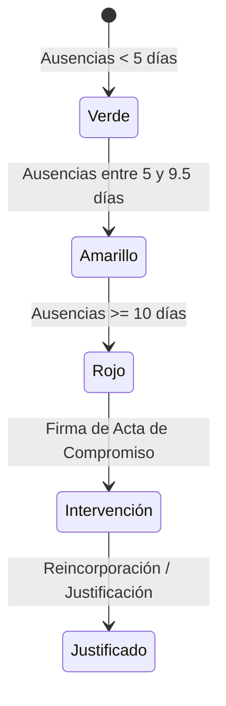

# Especificaciones Funcionales Completas: Sistema de Gestión CENS 454 (Esteban Echeverría)

> **Institución:** CENS N° 454 - Esteban Echeverría  
> **Nivel:** Educación Secundaria de Adultos  
> **Alcance:** Modulos funcionales, flujos de trabajo, reglas de negocio y casos de uso  

---

## 1. Módulo: Dashboard Directivo y Analítica Institucional

### 1.1 Objetivo
Brindar al equipo directivo y a la secretaría una visión sintética e interactiva en tiempo real sobre el estado general de la institución, la matrícula activa, la asistencia acumulada y los indicadores de retención escolar.

### 1.2 Funcionalidades Clave
* **Métricas Principales (KPI Cards):**
  * Matrícula Total Activa (Alumnos matriculados en el ciclo lectivo seleccionado).
  * Asistencia General (%) respecto del total de días dictados.
  * Alertas Críticas (Cantidad de estudiantes en semáforo rojo por ausentismo).
  * Solicitudes de Preinscripción Pendientes de revisión.
* **Gráficos Estadísticos (Recharts):**
  * *Distribución por Turno y Año:* Comparativa de estudiantes entre Turno Mañana, Tarde y Noche (1°, 2° y 3° año).
  * *Evolución Mensual de Inasistencias:* Tendencia de inasistencias a lo largo de los meses.
  * *Ratio de Retención Escolar:* Relación entre alumnos ingresantes vs. desgranamiento.
* **Filtro Global de Ciclo Lectivo:** Seleccionador superior para cambiar todo el contexto del dashboard entre ciclos lectivos (ej: 2024, 2025, 2026).

---

## 2. Módulo: Panel de Preceptores y Asistencia Diaria

### 2.1 Objetivo
Permitir a los preceptores tomar la asistencia diaria por curso, registrar novedades y generar las planillas consolidadas exigidas por la inspección distrital.

### 2.2 Reglas de Negocio y Estados de Asistencia
* **Tipos de Asistencia por Fecha:**
  * `Presente` (0 faltas).
  * `Ausente` (1 falta computable).
  * `Justificado` (1 falta justificada con certificado médico/laboral).
  * `Media Falta` (0.5 falta computable).
* **Cálculo de Inasistencias Acumuladas:**
  * El sistema calcula de forma automática el total de faltas computables sumando `Ausente + (0.5 * Media Falta)`.
  * No se computan para el límite de reincorporación las faltas en estado `Justificado`.
* **Impresión de Planilla de Curso (Anexo Oficial):**
  * Vista optimizada para impresión en papel A4 horizontal con grilla completa de días del mes, totales acumulados y firmas de preceptor/directivo.

---

## 3. Módulo: Alertas y Semáforo de Riesgo Pedagógico

### 3.1 Objetivo
Detectar de manera temprana el ausentismo recurrente para aplicar intervenciones institucionales y evitar el desgranamiento en la educación de adultos.

### 3.2 Clasificación Automática de Riesgo

* **Semáforo Verde (`Bajo Riesgo`):** Alumnos con menos de 5 inasistencias.
* **Semáforo Amarillo (`Riesgo Moderado`):** Alumnos con entre 5 y 9.5 inasistencias. Genera recordatorio al preceptor.
* **Semáforo Rojo (`Riesgo Crítico`):** Alumnos con 10 o más inasistencias. Dispara notificación al equipo directivo y habilita el botón para emitir el **Acta de Notificación / Compromiso de Asistencia**.
* **Bitácora de Observaciones:** Espacio para redactar llamadas telefónicas, visitas domiciliarias o entrevistas con el estudiante.

---

## 4. Módulo: Portal Docente y Carga de Calificaciones

### 4.1 Objetivo
Permitir a los profesores ingresar las calificaciones cuatrimestrales y finales de los cursos a su cargo.

### 4.2 Esquema de Carga Académica CENS
En la modalidad CENS (Resolución DGCyE), el periodo lectivo se organiza en:
* **1° Cuatrimestre:** Nota numérica (1 a 10).
* **2° Cuatrimestre:** Nota numérica (1 a 10).
* **Nota Final de Curso:** Calificación definitiva.
* **Periodo de Intensificación (RIE / Diciembre / Febrero):** Espacio para consignar aprobaciones en períodos de acompañamiento.

### 4.3 Asignación y Control de Accesos Docentes
* Los docentes solo pueden visualizar y editar las materias que tienen formalmente vinculadas en el sistema.
* **Cierre de Actas:** Una vez finalizado el cuatrimestre, el directivo puede "bloquear" el período para evitar alteraciones posteriores en las actas de notas.

---

## 5. Módulo: Portal del Estudiante (Boletín Digital)

### 5.1 Objetivo
Facilitar el acceso autónomo del estudiante adulto a su información académica desde cualquier dispositivo móvil o computadora.

### 5.2 Funcionalidades
* **Autenticación Simplificada:** Acceso mediante DNI/CUIL y clave personal.
* **Boletín de Calificaciones en Tiempo Real:** Visualización de notas cuatrimestrales por asignatura, estado de cursada y promedio.
* **Resumen de Asistencia Personal:** Detalle de inasistencias del mes y porcentaje de presencia.
* **Horarios de Cursada:** Grilla semanal con nombres de profesores y aulas asignadas.

---

## 6. Módulo: Libro de Temas DICYT y Partes Diarios

### 6.1 Objetivo
Digitalizar el Libro de Temas y el Registro de Desempeño Institucional y Curricular por Trayecto (DICYT).

### 6.2 Registro de Clase
Cada clase o módulo dictado requiere consignar:
* Fecha y Horario (Módulos 1°, 2°, 3°).
* Asignatura / Espacio Curricular.
* Nombre del Docente Titular o Suplente.
* Contenidos Conceptuales Desarrollados.
* Actividades Pedagógicas Realizadas.
* Firmas / Validación del Preceptor de Turno.

---

## 7. Módulo: Secretaría, Legajos y Certificaciones

### 7.1 Objetivo
Gestión completa de los registros administrativos de los estudiantes y docentes.

### 7.2 Funcionalidades
* **Edición Integral de Legajo:** Rectificación de nombres, CUIL/DNI, fecha de nacimiento, domicilio y teléfono de contacto.
* **Gestión de Bajas y Pases:** Registro formal de baja (por pase a otro CENS, abandono, u ocupación laboral), preservando el historial académico previo.
* **Emisión de Certificados:**
  * Certificado de Alumno Regular.
  * Certificado de Materias Aprobadas (Analítico Parcial).

---

## 8. Módulo: Generador de Anexos Oficiales (DOCX)

### 8.1 Objetivo
Exportación automatizada de planillas en formato Microsoft Word (.docx) cumpliendo estrictamente los modelos tipificados de la DGCyE (Provincia de Buenos Aires).

### 8.2 Plantillas Integradas
* **Anexo 4:** Planilla de Calificaciones y Asistencia por Turno/Curso.
* **Anexo 5:** Registro de Resumen Trimestral/Cuatrimestral para Inspección.

---

## 9. Módulo: Preinscripción Abierta a la Comunidad

### 9.1 Formulario Público (`/preinscripcion`)
Página web de acceso libre sin necesidad de login para nuevos aspirantes al CENS 454 de Esteban Echeverría:
1. Datos Personales (Nombre, Apellido, DNI/CUIL, Fecha de Nacimiento).
2. Datos de Contacto (Teléfono WhatsApp, Email, Domicilio en Esteban Echeverría).
3. Nivel de Estudios Alcanzado (Primaria Completa, Secundario Incompleto - indicando último año aprobado).
4. Preferencia de Turno (Mañana, Tarde, Noche).
5. Subida de fotos del DNI y Analítico anterior.

### 9.2 Panel de Gestión de Preinscripciones (Interno)
* El preceptor revisa las solicitudes salientes, las marca como `Aprobada`, `Documentación Incompleta` o `Rechazada`, y al aprobarlas crea automáticamente el legajo oficial del estudiante.
